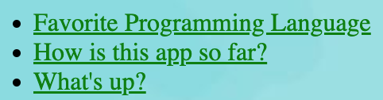
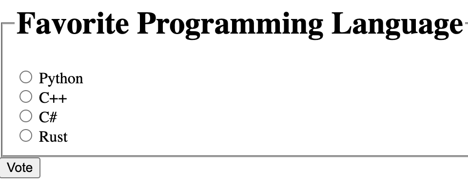
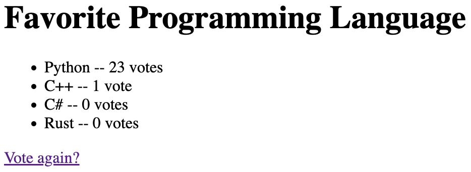

# 7_Django_Advanced
Another django project. This project created a simple polling application.

## Screenshots

### Homepage

### Poll Question

### Poll Results

## Objectives
Create a project in django 

### Learning Objectives

After completing this project I know:
 * How to create a complex django project
 * How to configure templates, urls, and more
 * How to create forms and use them with models to save data
 * How to build a multiple choice form
 * How to use the template language to display information from models

## Technologies Used

 * Python
 * Django
 * Django URLs, Models, Views, Templates, Forms
 * Bootstrap
 * Django Template Language
